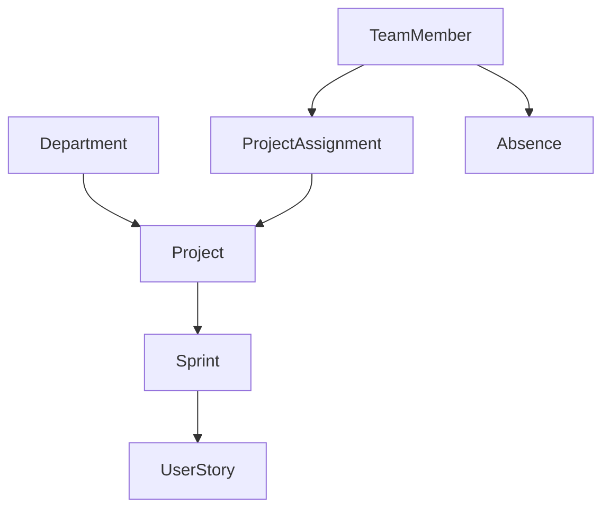
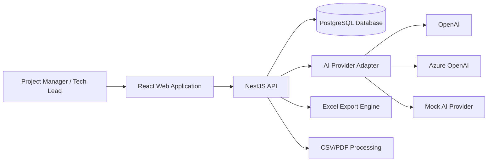
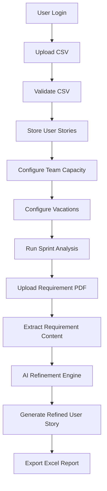
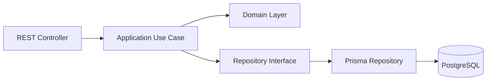
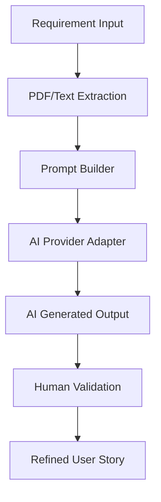

# DeliveryOps AI - Technical Design

# Table of Contents

1. Technical Overview
2. Architecture Goals
3. Technology Stack
4. Repository Strategy
5. High-Level Architecture
6. C4 Model
7. Frontend Architecture
8. Backend Architecture
9. Database Strategy
10. AI Architecture
11. File Processing Strategy
12. Export Strategy
13. Authentication Strategy
14. State Management Strategy
15. Testing Strategy
16. CI/CD Strategy
17. Deployment Strategy
18. Security Considerations
19. Engineering Workflow
20. Technical Non-Goals

---

# 1. Technical Overview

DeliveryOps AI will be implemented as a modular SaaS web application with a React frontend, a NestJS backend, and a PostgreSQL database.

The system will support an end-to-end workflow for importing User Stories, configuring team capacity, analyzing sprint feasibility, refining requirements with AI, and exporting operational reports.

The architecture will prioritize:

- maintainability
- testability
- modularity
- AI-provider decoupling
- low operational cost
- future scalability

The first implementation will focus on a pragmatic modular monolith rather than microservices.

---

# 2. Architecture Goals

The technical architecture must support:

- A complete E2E flow for the Master project delivery
- Clear separation between frontend, backend, domain logic, infrastructure, and AI providers
- Future integration with Rally, Jira, Confluence, or other delivery tools
- Free-tier deployment
- Automated testing and CI/CD
- AI-assisted development using Cursor, SpecKit, BDD, rules, skills, and documented prompts

---

# 3. Technology Stack

## Frontend

- React
- TypeScript
- Vite
- Tailwind CSS
- shadcn/ui
- TanStack Query
- Zustand
- React Hook Form
- Zod
- Vitest
- React Testing Library
- Playwright

## Backend

- Node.js
- NestJS
- TypeScript
- Prisma ORM
- PostgreSQL
- Jest
- Supertest

## Infrastructure

- GitHub
- GitHub Actions
- Docker
- Docker Compose
- Vercel for frontend deployment
- Render for backend deployment
- Neon for PostgreSQL free-tier hosting

## AI

- AI Provider Adapter Pattern
- OpenAI-compatible provider
- Azure OpenAI-compatible provider
- Mock AI provider for local development and demos

---

# 4. Repository Strategy

The project will use a monorepo structure.

## Proposed Structure

~~~text
AI4Devs-finalproject/
  README.md
  prompts.md

  docs/
    01-product-definition.md
    02-functional-specification.md
    03-technical-design.md
    04-data-model.md
    05-user-stories.md
    06-technical-backlog.md
    07-ai-development-workflow.md
    08-delivery-plan.md

  docs/bdd/
    auth.feature
    sprint-planning.feature
    refinement-engine.feature
    export-engine.feature

  docs/adr/
    001-tech-stack.md
    002-ai-provider-strategy.md
    003-deployment-strategy.md

  apps/
    web/
    api/

  packages/
    shared/
~~~

## Rationale

A monorepo is preferred because it allows:

- shared types between frontend and backend
- simpler project navigation
- easier Master project review
- consistent tooling
- centralized documentation
- better Cursor context usage

---

# 5. High-Level Architecture

DeliveryOps AI will follow a modular client-server architecture:

~~~text
React Web App
   |
   | HTTPS / REST API
   v
NestJS API
   |
   | Prisma ORM
   v
PostgreSQL Database

NestJS API
   |
   | AI Provider Adapter
   v
OpenAI / Azure OpenAI / Mock Provider
~~~

The backend will be the source of truth for domain data, while the frontend will focus on user interaction, form handling, and visualizing results.

---

# 6. C4 Model

## 6.1 C4 Level 1 - System Context

~~~text
[Project Manager / Tech Lead]
            |
            v
    [DeliveryOps AI]
            |
            +--> [AI Provider]
            |
            +--> [PostgreSQL Database]
            |
            +--> [CSV/PDF Files]
            |
            +--> [Excel Export]
~~~

DeliveryOps AI allows delivery users to import User Stories, configure team capacity, refine requirements using AI, and export operational reports.

---

## 6.2 C4 Level 2 - Containers

~~~text
[User]
  |
  v
[Web App - React]
  |
  v
[API - NestJS]
  |
  +--> [PostgreSQL - Neon]
  |
  +--> [AI Provider Adapter]
  |
  +--> [File Processing Service]
  |
  +--> [Export Service]
~~~

## Containers

### Web App

Responsible for:

- authentication UI
- CSV upload flow
- team configuration UI
- sprint analysis dashboard
- refinement UI
- export actions

### API

Responsible for:

- authentication
- business use cases
- file parsing
- persistence
- AI provider integration
- export generation

### Database

Responsible for storing:

- users
- projects
- sprints
- team members
- absences
- imported User Stories
- refinement results

### AI Provider

Responsible for:

- requirement refinement
- gap analysis
- acceptance criteria generation

---

## 6.3 C4 Level 3 - Backend Components

~~~text
NestJS API
  |
  +-- Auth Module
  +-- Projects Module
  +-- User Stories Module
  +-- Team Capacity Module
  +-- Sprint Analysis Module
  +-- Requirement Processing Module
  +-- Refinement Module
  +-- Export Module
  +-- AI Provider Module
~~~

Each backend module will follow a pragmatic Clean Architecture and Hexagonal Architecture approach.

---

# 7. Frontend Architecture

The frontend will use a feature-based structure with clear separation of responsibilities.

## Proposed Structure

~~~text
apps/web/src/
  app/
    router/
    providers/
    layout/

  shared/
    components/
    hooks/
    utils/
    api/
    types/

  features/
    auth/
      domain/
      application/
      infrastructure/
      presentation/

    user-stories/
      domain/
      application/
      infrastructure/
      presentation/

    sprint-planning/
      domain/
      application/
      infrastructure/
      presentation/

    refinement/
      domain/
      application/
      infrastructure/
      presentation/

    export/
      domain/
      application/
      infrastructure/
      presentation/
~~~

## Frontend Principles

- Feature-based organization
- Components must remain small and focused
- Business logic must not live inside UI components
- Server state will be managed with TanStack Query
- Local UI state will be managed with Zustand when needed
- Forms will use React Hook Form and Zod
- Styling will use Tailwind CSS and shadcn/ui
- UI must prioritize clarity and operational usability over visual complexity

---

# 8. Backend Architecture

The backend will use NestJS with a modular Clean Architecture approach.

## Proposed Structure

~~~text
apps/api/src/
  main.ts
  app.module.ts

  modules/
    auth/
      domain/
      application/
      infrastructure/
      presentation/

    projects/
      domain/
      application/
      infrastructure/
      presentation/

    user-stories/
      domain/
      application/
      infrastructure/
      presentation/

    team-capacity/
      domain/
      application/
      infrastructure/
      presentation/

    sprint-analysis/
      domain/
      application/
      infrastructure/
      presentation/

    requirement-processing/
      domain/
      application/
      infrastructure/
      presentation/

    refinement/
      domain/
      application/
      infrastructure/
      presentation/

    export/
      domain/
      application/
      infrastructure/
      presentation/

    ai-provider/
      domain/
      application/
      infrastructure/
      presentation/
~~~

## Backend Layer Responsibilities

### Domain

Contains:

- domain entities
- value objects
- domain rules
- repository contracts

### Application

Contains:

- use cases
- application services
- command/query handlers if needed

### Infrastructure

Contains:

- Prisma repositories
- external provider integrations
- file system adapters
- AI provider implementations

### Presentation

Contains:

- REST controllers
- DTOs
- request validation
- response mapping

## Backend Principles

- Controllers must remain thin
- Use cases must contain application logic
- Domain rules must not depend on infrastructure
- Prisma must remain inside infrastructure
- AI providers must be accessed through interfaces
- Modules must be independently testable

---

# 9. Database Strategy

PostgreSQL will be used as the relational database.

Prisma ORM will be used for:

- schema definition
- migrations
- database access
- type-safe queries

The initial model will include:

- User
- Department
- Project
- Sprint
- TeamMember
- ProjectAssignment
- Absence
- UserStory
- RequirementDocument
- RefinementResult
- ExportJob

## Initial Domain Relationships

The data model is designed to support:

- multiple departments
- multiple projects
- temporary cross-project assignments
- future scalability for delivery operations

The detailed database schema will be defined in:

~~~text
docs/04-data-model.md
~~~

---

# 10. AI Architecture

The AI integration will be decoupled from the domain using an adapter-based approach.

## Provider Interface

~~~text
AIProvider
  - refineRequirement(input)
  - detectGaps(input)
  - generateAcceptanceCriteria(input)
~~~

## Implementations

- OpenAIProvider
- AzureOpenAIProvider
- MockAIProvider

## AI Design Principles

- The system must not depend directly on a specific AI vendor
- AI responses must be treated as suggestions
- AI outputs must be reviewable by the user
- Prompts must be versioned and documented
- Mock mode must be available for free demos and predictable tests
- AI usage must be documented in prompts.md

---

# 11. File Processing Strategy

## CSV Processing

The system will support CSV import for User Stories.

The CSV parser must:

- validate file type
- validate required columns
- parse rows
- report invalid rows
- store valid User Stories

## PDF Processing

The system will support basic PDF text extraction.

The PDF processor must:

- validate file type
- extract readable text
- reject empty documents
- prepare extracted text for refinement

Advanced OCR for scanned PDFs is out of scope for the initial MVP.

---

# 12. Export Strategy

The platform will generate Excel exports.

Exports may include:

- imported User Stories
- team capacity summary
- sprint analysis results
- refinement outputs
- risk indicators

The export implementation should be isolated in the Export Module to allow future formats.

Possible future formats:

- CSV
- PDF report
- JSON

---

# 13. Authentication Strategy

The platform must not be publicly accessible without authentication.

The MVP will include:

- user registration
- login
- logout
- protected API routes
- protected frontend routes

For the MVP, authentication should remain simple and maintainable.

Recommended approach:

- email/password authentication
- JWT-based backend authentication
- password hashing
- secure environment variables

Advanced enterprise authentication such as SSO is out of scope for the MVP.

---

# 14. State Management Strategy

## Server State

TanStack Query will manage server state:

- User Stories
- Team capacity data
- Sprint analysis
- Refinement results
- Export status

## Local UI State

Zustand will be used only when local UI state becomes necessary:

- current wizard step
- selected User Story
- temporary UI filters
- modal state

## Form State

React Hook Form and Zod will manage forms and validation.

## Principle

The backend is the source of truth. The frontend must avoid a large global store.

---

# 15. Testing Strategy

The project must include:

- unit tests
- integration tests
- at least one E2E test for the main flow

## Frontend Tests

Tools:

- Vitest
- React Testing Library
- Playwright

Focus:

- form validation
- dashboard rendering
- user interactions
- E2E flow

## Backend Tests

Tools:

- Jest
- Supertest

Focus:

- use cases
- domain rules
- API endpoints
- CSV parsing
- sprint analysis calculations
- AI provider mock integration

## E2E Test Scope

The main E2E test should cover:

~~~text
Login
Upload CSV
Configure team capacity
Run sprint analysis
Refine User Story
Export results
~~~

---

# 16. CI/CD Strategy

GitHub Actions will be used for CI/CD.

Initial pipeline should include:

- install dependencies
- lint
- frontend tests
- backend tests
- build frontend
- build backend

Future pipeline improvements:

- Playwright E2E tests
- deployment checks
- Prisma migration checks

---

# 17. Deployment Strategy

The project must be deployable using free-tier services.

## Recommended Deployment

- Frontend: Vercel
- Backend: Render
- Database: Neon PostgreSQL
- CI/CD: GitHub Actions

## Environment Variables

Secrets must be configured using platform environment variables.

Examples:

- DATABASE_URL
- JWT_SECRET
- AI_PROVIDER
- OPENAI_API_KEY
- AZURE_OPENAI_API_KEY

## AI Cost Strategy

The system must support a mock AI provider to avoid mandatory AI API costs during demos.

---

# 18. Security Considerations

The system must include basic security practices:

- authenticated access
- password hashing
- protected API routes
- input validation
- file type validation
- environment-based secrets
- no secrets committed to GitHub
- controlled CORS configuration

---

# 19. Engineering Workflow

The project will use a Pull Request based workflow.

## Branch Strategy

- feature-entrega1-DLP
- feature-entrega2-DLP
- finalproject-DLP

## Pull Request Rules

Each PR should include:

- clear title
- summary of changes
- linked User Stories or tickets when applicable
- testing notes
- screenshots if UI changes are included

## AI-Assisted Development

Cursor will be used with:

- project rules
- reusable skills
- BDD scenarios
- SpecKit documentation
- prompt history documented in prompts.md

Detailed AI workflow will be defined in:

~~~text
docs/07-ai-development-workflow.md
~~~

---

# 20. Technical Non-Goals

The initial MVP will not include:

- microservices
- event-driven architecture
- complex enterprise RBAC
- real-time collaboration
- advanced OCR
- autonomous AI agents in production
- paid infrastructure dependency
- complex multi-tenant architecture

---

# 21. Architecture Decision Records (ADR)

## ADR-001 - Modular Monolith Instead of Microservices

### Decision

The system will initially use a modular monolith architecture instead of microservices.

### Rationale

Reasons for this decision:

- Reduced operational complexity
- Faster development speed
- Easier local setup
- Simpler deployment
- Better alignment with Master project scope
- Easier AI-assisted development workflow
- Better maintainability for a single developer project

### Future Evolution

The modular structure will allow future extraction of modules into independent services if needed.

---

## ADR-002 - Monorepo Strategy

### Decision

The project will use a monorepo structure.

### Rationale

Reasons for this decision:

- Shared types between frontend and backend
- Centralized documentation
- Easier dependency management
- Better Cursor context awareness
- Simpler CI/CD pipelines
- Easier project review for the Master

---

## ADR-003 - AI Provider Decoupling

### Decision

AI providers will be accessed through adapter interfaces.

### Rationale

Reasons for this decision:

- Avoid vendor lock-in
- Support multiple providers
- Support mock AI providers
- Reduce operational costs
- Improve testing capabilities

---

# 22. Architecture Diagrams

# 22.1 High-Level System Architecture

---

# 22.2 Main End-to-End Flow

---

# 22.3 Backend Architecture Flow

---

# 22.4 AI Refinement Flow

---

# 23. Future Technical Evolution

Potential future technical evolution may include:

- Event-driven architecture
- Background job processing
- AI workflow orchestration
- Dedicated analytics services
- Multi-tenant architecture
- Advanced observability
- AI memory/context management
- Retrieval-Augmented Generation (RAG)
- Vector database integration
- Autonomous AI agents

These capabilities are intentionally excluded from the initial MVP implementation to maintain scope control and delivery feasibility.

---

# 24. Technical Design Summary

DeliveryOps AI will use a modern modular SaaS architecture focused on:

- maintainability
- operational simplicity
- AI-provider flexibility
- scalable domain separation
- pragmatic Clean Architecture
- testability
- free-tier deployability

The architecture is intentionally designed to balance:

- Master project delivery constraints
- future scalability
- AI-assisted engineering workflows
- maintainable implementation complexity

# 25. TDD Strategy

The backend core logic will follow a pragmatic TDD approach using RED-GREEN-REFACTOR.

The TDD approach will be applied selectively to critical backend logic:

- sprint capacity calculation
- vacation and absence impact
- capacity vs demand analysis
- CSV validation
- AI mock provider behavior
- Excel export generation

TDD will not be applied strictly to simple controllers, DTOs, or framework configuration.

The goal is to ensure that business rules are validated before implementation and that the backend core remains reliable, testable, and easy to refactor.