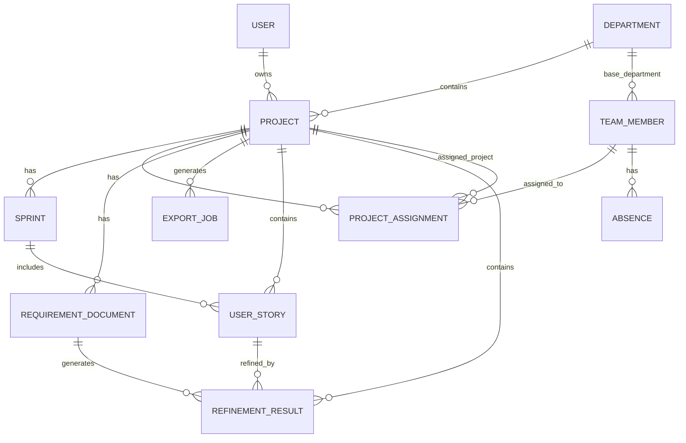

# DeliveryOps AI - Data Model

# Table of Contents

1. Data Model Overview
2. Design Principles
3. Core Entities
4. Entity Relationships
5. Entity Details
6. Mermaid ER Diagram
7. MVP Data Scope
8. Future Data Scope
9. Prisma Strategy
10. Data Validation Rules
11. Data Model Summary

---

# 1. Data Model Overview

The DeliveryOps AI data model is designed to support sprint planning, team capacity analysis, User Story refinement, and operational reporting.

The model supports:

- multiple departments
- multiple projects
- team members with a base department
- temporary project assignments across departments
- sprint planning
- absences and vacations
- imported User Stories
- requirement documents
- AI refinement results
- Excel export jobs

The model is intentionally pragmatic and focused on the Master project MVP while allowing future growth.

---

# 2. Design Principles

The data model follows these principles:

- Keep the MVP model simple and understandable
- Support real delivery operations without overengineering
- Separate stable ownership from temporary allocation
- Keep AI outputs traceable
- Keep export generation traceable
- Use relational data for operational consistency
- Avoid enterprise-level complexity in the initial MVP

---

# 3. Core Entities

The initial data model includes:

- User
- Department
- Project
- Sprint
- TeamMember
- ProjectAssignment
- Absence
- UserStory
- RequirementDocument
- RefinementResult
- ExportJob

---

# 4. Entity Relationships

## Main Relationships

- A User can create multiple Projects
- A Department can contain multiple Projects
- A TeamMember has one base Department
- A TeamMember can be assigned to multiple Projects over time
- A Project can have multiple ProjectAssignments
- A Project can have multiple Sprints
- A Sprint can contain multiple UserStories
- A TeamMember can have multiple Absences
- A RequirementDocument belongs to a Project
- A RequirementDocument can generate multiple RefinementResults
- A UserStory can have multiple RefinementResults
- A Project can generate multiple ExportJobs

## Key Concept

The model separates:

- **base department**: the team member's default organizational department
- **project assignment**: the actual project allocation during a specific period

This allows a developer from one department to temporarily work on projects from another department without duplicating the person or losing historical context.

---

# 5. Entity Details

## 5.1 User

Represents an authenticated platform user.

### Fields

- id
- name
- email
- passwordHash
- createdAt
- updatedAt

### Notes

The User entity is used for authentication and ownership of created resources.

---

## 5.2 Department

Represents an organizational area or delivery unit.

Examples:

- Riesgo
- Ahorro
- Pensiones

### Fields

- id
- name
- description
- createdAt
- updatedAt

### Relationships

- Department has many Projects
- Department has many TeamMembers as base department

---

## 5.3 Project

Represents a software delivery project.

### Fields

- id
- name
- description
- departmentId
- ownerId
- status
- createdAt
- updatedAt

### Relationships

- Project belongs to Department
- Project belongs to User as owner
- Project has many Sprints
- Project has many ProjectAssignments
- Project has many RequirementDocuments
- Project has many ExportJobs

### Status Values

- active
- paused
- completed

---

## 5.4 Sprint

Represents a planning period for a project.

### Fields

- id
- projectId
- name
- startDate
- endDate
- capacityPoints
- demandPoints
- riskStatus
- createdAt
- updatedAt

### Relationships

- Sprint belongs to Project
- Sprint has many UserStories

### Risk Status Values

- healthy
- warning
- overloaded

---

## 5.5 TeamMember

Represents a developer, tech lead, QA, or team contributor.

### Fields

- id
- name
- role
- baseDepartmentId
- defaultCapacityPoints
- createdAt
- updatedAt

### Relationships

- TeamMember belongs to Department as base department
- TeamMember has many ProjectAssignments
- TeamMember has many Absences

### Notes

The base department represents the default organizational ownership of the person.

Temporary movement between departments is represented through ProjectAssignment.

---

## 5.6 ProjectAssignment

Represents the assignment of a team member to a project for a specific period.

### Fields

- id
- teamMemberId
- projectId
- startDate
- endDate
- allocationPercentage
- capacityPointsOverride
- createdAt
- updatedAt

### Relationships

- ProjectAssignment belongs to TeamMember
- ProjectAssignment belongs to Project

### Notes

This entity supports:

- temporary cross-department assignments
- partial allocation
- future capacity distribution
- historical assignment tracking

For the MVP, allocation can be simplified and handled manually.

---

## 5.7 Absence

Represents vacations or non-working days for a team member.

### Fields

- id
- teamMemberId
- startDate
- endDate
- type
- createdAt
- updatedAt

### Relationships

- Absence belongs to TeamMember

### Type Values

- vacation
- sick_leave
- personal_day
- other

### Notes

Absences reduce available capacity during sprint calculations.

---

## 5.8 UserStory

Represents a User Story imported from CSV or created from refinement.

### Fields

- id
- projectId
- sprintId
- externalId
- title
- description
- storyPoints
- status
- source
- createdAt
- updatedAt

### Relationships

- UserStory belongs to Project
- UserStory optionally belongs to Sprint
- UserStory can have many RefinementResults

### Source Values

- csv
- ai_generated
- manual

### Status Values

- draft
- ready
- in_progress
- done
- blocked

---

## 5.9 RequirementDocument

Represents an uploaded requirement document.

### Fields

- id
- projectId
- fileName
- fileType
- extractedText
- createdAt
- updatedAt

### Relationships

- RequirementDocument belongs to Project
- RequirementDocument can have many RefinementResults

### File Type Values

- pdf
- txt

---

## 5.10 RefinementResult

Represents the result generated by the AI-assisted refinement process.

### Fields

- id
- projectId
- requirementDocumentId
- userStoryId
- originalContent
- refinedTitle
- refinedDescription
- acceptanceCriteria
- detectedGaps
- implementationNotes
- aiProvider
- createdAt
- updatedAt

### Relationships

- RefinementResult belongs to Project
- RefinementResult can belong to RequirementDocument
- RefinementResult can belong to UserStory

### Notes

AI-generated content must remain editable and subject to human validation.

---

## 5.11 ExportJob

Represents a generated export file.

### Fields

- id
- projectId
- type
- status
- fileName
- fileUrl
- createdAt
- updatedAt

### Relationships

- ExportJob belongs to Project

### Type Values

- sprint_analysis
- refined_user_stories
- full_report

### Status Values

- pending
- completed
- failed

---

# 6. Mermaid ER Diagram

---

# 7. MVP Data Scope

The MVP will persist:

- authenticated users
- departments
- projects
- sprints
- team members
- project assignments
- absences
- imported User Stories
- requirement documents
- refinement results
- export jobs

The MVP will not implement advanced enterprise capabilities such as:

- role-based access control
- detailed audit logs
- organization-level multi-tenancy
- billing data
- complex permission inheritance

---

# 8. Future Data Scope

Future versions may extend the data model with:

- Organization
- Workspace
- Role
- Permission
- AuditLog
- IntegrationConnection
- ExternalToolMapping
- Notification
- Comment
- Dependency
- RiskAssessment
- PlanningScenario
- AIConversation
- VectorEmbedding

These are intentionally excluded from the MVP to avoid unnecessary complexity.

---

# 9. Prisma Strategy

Prisma will be used to define the database schema and generate type-safe database access.

## Naming Conventions

- Models use PascalCase
- Fields use camelCase
- Database table names can remain Prisma defaults unless explicitly needed
- Enum values use lowercase snake_case

## ID Strategy

Each entity will use a generated unique ID.

Recommended approach:

- UUID or CUID
- Created automatically by Prisma

## Timestamp Strategy

Each main entity will include:

- createdAt
- updatedAt

## Deletion Strategy

For the MVP:

- hard delete is acceptable for non-critical records
- soft delete can be introduced later if needed

Soft delete is not mandatory in the initial MVP to avoid unnecessary complexity.

---

# 10. Data Validation Rules

## General Rules

- Required fields cannot be empty
- Dates must be valid
- End dates must be greater than or equal to start dates
- Numeric values must be valid numbers
- Capacity values cannot be negative

## Department Rules

- Department name is required
- Department name should be unique per user or workspace in future versions

## Project Rules

- Project name is required
- Project must belong to a Department
- Project status must be one of the allowed values

## Sprint Rules

- Sprint must belong to a Project
- Sprint start date is required
- Sprint end date is required
- Sprint demand is calculated from User Story points

## Team Member Rules

- Team member name is required
- Team member role is required
- Team member must have a base Department
- Default capacity cannot be negative

## Project Assignment Rules

- Assignment must reference a TeamMember
- Assignment must reference a Project
- Assignment dates must be valid
- Allocation percentage must be between 0 and 100
- Capacity override cannot be negative

## Absence Rules

- Absence must reference a TeamMember
- Absence dates must be valid
- Absence type must be one of the allowed values
- Absences reduce available capacity during sprint analysis

## User Story Rules

- Title is required
- Story Points must be numeric
- Story Points cannot be negative
- Source must be one of the allowed values
- Status must be one of the allowed values

## Requirement Document Rules

- File name is required
- File type must be supported
- Extracted text cannot be empty after processing

## Refinement Result Rules

- Original content is required
- Refined output should preserve original intent
- AI provider must be recorded
- AI-generated content requires human validation

## Export Job Rules

- Export type must be valid
- Export status must be valid
- Completed exports must provide a file reference

---

# 11. Data Model Summary

The DeliveryOps AI data model provides a pragmatic foundation for the MVP while supporting future growth.

The model is intentionally designed to support:

- real delivery planning workflows
- multi-project visibility
- cross-department temporary assignments
- sprint capacity analysis
- AI-assisted refinement traceability
- export generation

The model avoids unnecessary enterprise complexity while preserving the ability to evolve into a more advanced SaaS platform.